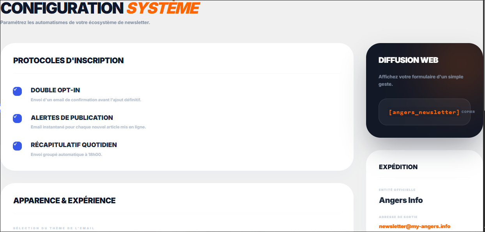
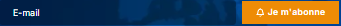
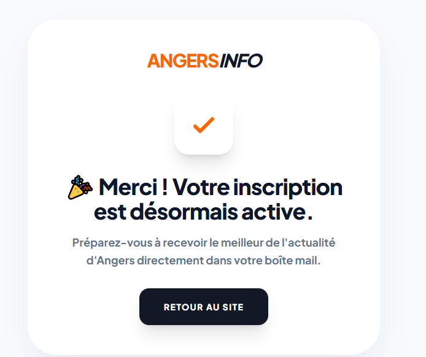
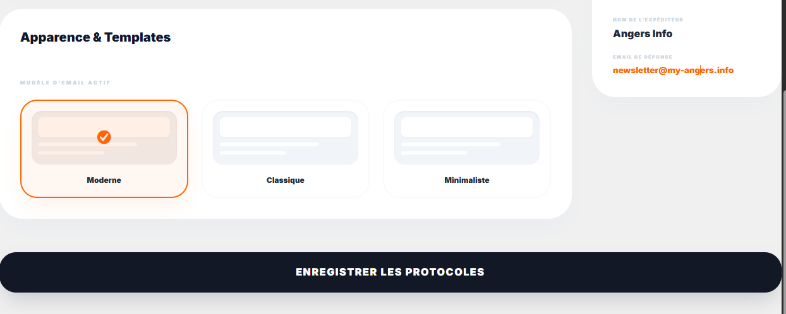
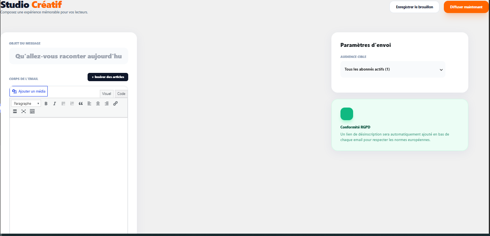

# Rapport de Projet : Solution Newsletter sur Mesure

**Dates de développement :** 09/06/2024 et 10/06/2024
**Projet :** My Angers Newsletter
**Client :** Direction my-angers.info

---

## 1. Vision Stratégique et Objectifs

Le projet **My Angers Newsletter** est né de la volonté de s'affranchir des solutions propriétaires onéreuses tout en montant en gamme sur l'expérience utilisateur et l'automatisation.

### Bénéfices atteints :
- **Économie Radicale :** Suppression du coût mensuel de 85€ (ex-Mailchimp), soit **1020€ d'économie annuelle**.
- **Productivité :** Insertion d'articles en 2 clics au lieu d'un copier-coller manuel fastidieux.
- **Personnalisation :** Segmentation automatique par départements/catégories pour un contenu ultra-pertinent.

---

## 2. Centre de Pilotage (Dashboard)

L'administration est conçue comme un cockpit futuriste, privilégiant la clarté et l'action rapide.

- **Statistiques Live :** Visualisation immédiate de l'engagement (Ouvertures et Clics) avec des indicateurs de performance.
- **Activités Récentes :** Historique des envois avec indicateurs de statut (Draft, Sent).

---

## 3. Gestion de l'Audience et Abonnés

Un espace dédié permet une gestion granulaire de votre communauté.

### Fonctionnalités Clés :
- **Import/Export CSV :** Migration simplifiée de vos bases de données existantes.
- **Gestion des Départements :** Les abonnés choisissent leurs éditions préférées (Maine-et-Loire, Sarthe, etc.) basées sur vos catégories WordPress.
- **Sélection Manuelle des Destinataires :** Lors de l'envoi, vous pouvez choisir d'envoyer à toute la base ou sélectionner manuellement des segments spécifiques.

---

## 4. Le Studio Créatif : Éditeur de Campagnes

Cœur battant du plugin, le Studio permet de créer des mails visuellement riches sans aucune connaissance technique.

### L'intelligence au service du contenu :
Fini le temps perdu à chercher les images et les liens de vos articles. Notre modal d'importation fait tout le travail pour vous.

1. Ouvrez la bibliothèque d'articles.
2. Cochez les sujets à diffuser.
3. Cliquez sur "Insérer". C'est prêt.

---

## 5. Automatisation et Intelligence Artificielle

La solution intègre des triggers automatiques pour maintenir le lien avec votre audience.

- **Mail de Bienvenue (Angers Press) :** Un contenu personnalisé envoyé instantanément après validation.
- **Notification Post-Publication :** Alerte automatique des abonnés dès qu'un nouvel article est en ligne.
- **Daily Digest Intelligent :** Un récapitulatif élégant envoyé chaque soir à 18h00, personnalisé selon les départements choisis par chaque abonné. Si aucun article n'est publié dans ses sections, aucun mail n'est envoyé pour éviter de polluer sa boîte.
- **Expérience Interactive :** Un popup moderne après la saisie de l'email permet une segmentation immédiate et fluide.

---

## 6. Expérience Abonné et Design Frontend

La confiance de vos lecteurs est précieuse. Nous avons soigné chaque point de contact.

### Intégration Shortcode
Un champ de saisie minimaliste et performant s'intègre parfaitement dans votre footer.

### Parcours de Validation (Double Opt-in)
Protection contre le spam et garantie de qualité de la base de données.

*L'email reçu par l'utilisateur.*

*La page de succès après clic sur le bouton.*

---

## 7. Statistiques et Thèmes

Suivez vos performances et adaptez votre image de marque.

- **Analyse des Clics :** Suivi précis des liens les plus consultés.
- **Tracking 1x1 :** Pixel invisible pour mesurer le taux d'ouverture réel.
- **Personnalisation :** Choisissez l'esthétique qui vous ressemble parmi les thèmes disponibles.

---

## 8. Conformité et Sécurité

- **Lien de Désinscription :** Présent et fonctionnel sur chaque envoi.
- **Sécurité des Jetons :** Utilisation de tokens cryptographiques pour les actions d'abonnement/désabonnement.
- **Optimisation Serveur :** Envoi optimisé pour ne pas impacter les performances de l'hébergement.

---

## Conclusion

Ce développement livre un outil complet, autonome et évolutif, parfaitement aligné avec l'identité de **My Angers Info**.

Je reste dans l'attente de vos remarques ou modifications éventuelles.
